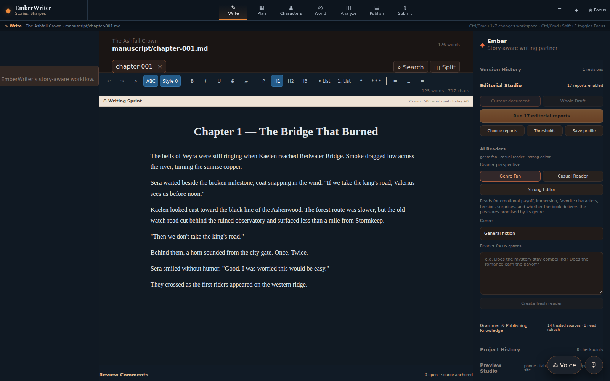
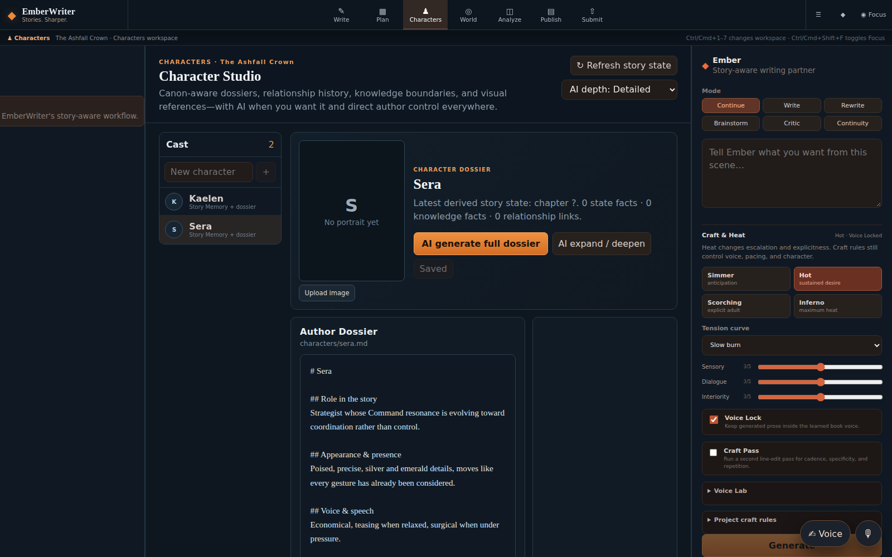
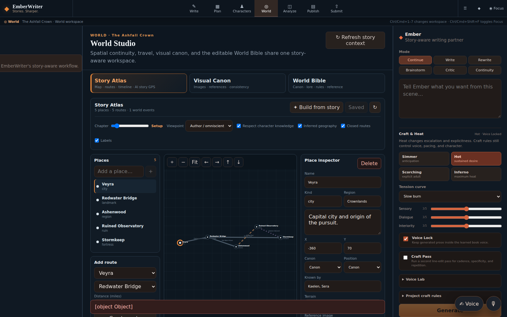
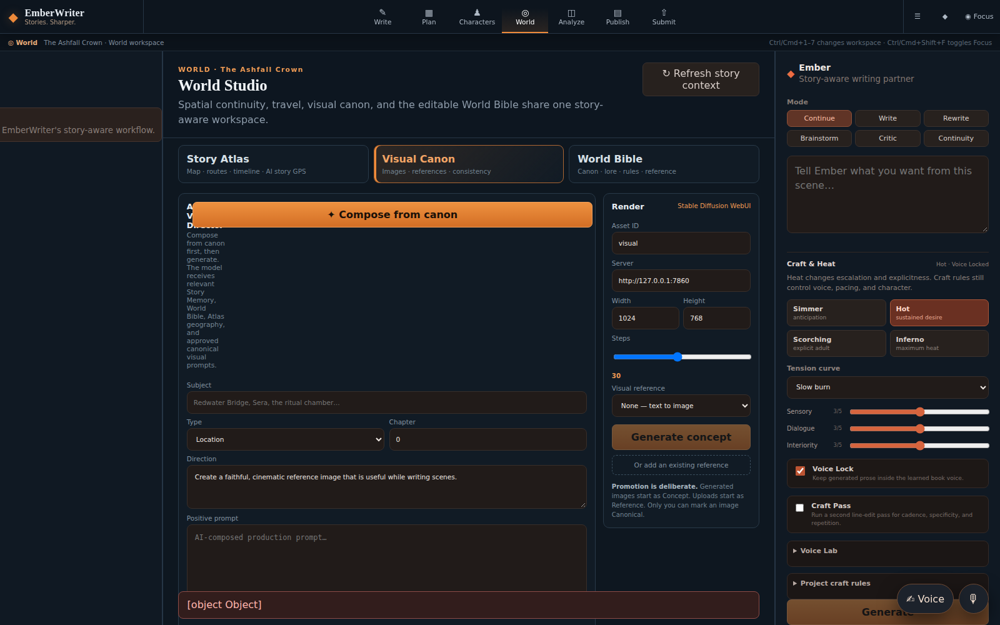
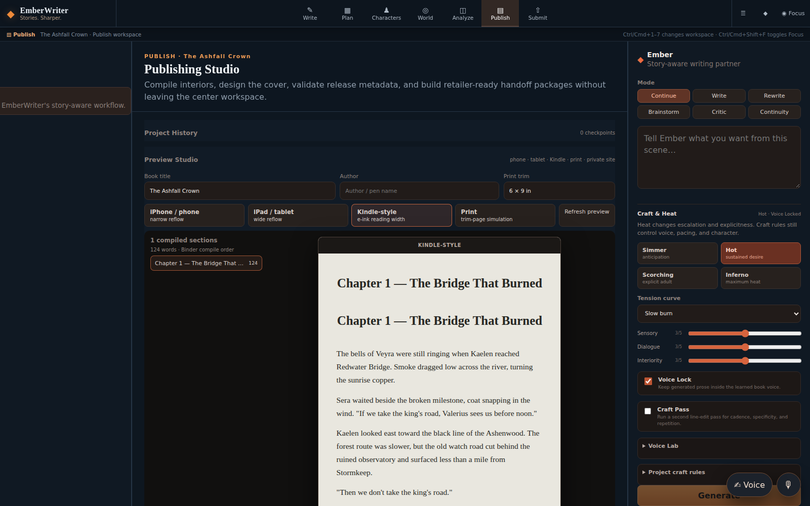

# EmberWriter

**A local-first, AI-assisted fiction studio for writing, planning, continuity, worldbuilding, spatial story design, editorial analysis, visual canon, publishing, and submission.**

EmberWriter is designed around one rule: **the author owns the story and the manuscript remains the source of truth**. Your prose, character dossiers, world notes, planning files, Story Atlas, visual metadata, publishing configuration, and exports remain readable project files on your machine. SQLite is used where it is useful for revisions, indexes, Story Intelligence, editorial history, and trusted reference retrieval, but the novel is not trapped inside a proprietary database.

The current application uses a seven-workspace writing environment—**Write, Plan, Characters, World, Analyze, Publish, and Submit**—with a story-aware AI layer that can use local models through Ollama or any compatible OpenAI-style endpoint.

> The screenshots below are generated from a synthetic documentation project named **The Ashfall Crown**. They contain no user manuscript data.

## Platform at a glance

| Workspace | What it is for |
| --- | --- |
| **Write** | Rich manuscript editing, Binder navigation, tabs, split editing, search/replace, bookmarks, revisions, focus mode, story-aware generation, comments, sprints, and idea capture. |
| **Plan** | Timeline, author events, beat sheets, Scene Architect, story map, plot beats, character arcs, relationship progression, unresolved threads, and visual corkboard planning. |
| **Characters** | Canon-aware character dossiers, knowledge boundaries, relationship history, chemistry, voice/performance profiles, portraits, and character-specific visual references. |
| **World** | World Bible, Story Atlas, Story GPS routing, location/route continuity, chapter-aware geography, character knowledge views, and Visual Canon. |
| **Analyze** | Deterministic editorial diagnostics, AI readers, grammar/reference guidance, provenance, continuity, voice fidelity, and revision review. |
| **Publish** | Interior compile, preview, Cover Studio, release metadata, distributor checks, exact artifact binding, and reproducible retailer handoff packages. |
| **Submit** | Traditional submission package development, query/synopsis/sample preparation, destination requirements, and submission tracking. |

## Write: the manuscript stays central



The Write workspace keeps the manuscript editor visually dominant while the Binder and Ember assistant remain available when needed. Both side regions can be hidden independently, and **Focus mode** collapses surrounding chrome so the active document becomes the working surface. Workspace and focus preferences persist between sessions; keyboard shortcuts provide fast movement among all seven studios.

The writing environment includes:

- Binder-style project organization with stable node IDs independent of filenames;
- Draft, Research, Story Bible, reversible Trash, nested folders/documents, metadata, collections, compile inclusion, targets, and missing-source detection;
- rich TipTap editing with undo/redo, headings, bold, italic, underline, strike, highlight, lists, block quotes, scene breaks, alignment, browser spellcheck, selected-text actions, and live word/character counts;
- portable Markdown/HTML-compatible round-tripping rather than proprietary editor HTML as the only manuscript copy;
- autosave plus explicit Save;
- multiple persistent document tabs per project;
- a second editable split pane for side-by-side manuscript/reference work;
- project-wide search and replace with impact preview and a whole-project checkpoint before destructive replacement;
- bookmarks that reopen their linked source;
- comments/review annotations, sprint tooling, live prose diagnostics, and revision history;
- a Talk / Idea Capture overlay that preserves raw notes and can route them to an inbox, Beat Sheet, World, Character, Scene, or project notes without silently modifying manuscript prose;
- manuscript-wide **Voice Fingerprint** plus quick Voice Lab analysis;
- story-aware AI modes for Write, Continue, Rewrite, Brainstorm, Critic, and Continuity.

### Import and ingest

EmberWriter can import complete novels, portions, ideas/notes, or research through the UI. Supported upload formats include **DOCX, PDF, EPUB, RTF, Markdown, TXT, and HTML**, plus pasted text. DOCX preserves the supported inline formatting/alignment set, EPUB follows book spine order, and whole-novel import detects chapter/prologue/epilogue/interlude/part boundaries and creates real Binder documents.

Imported documents receive baseline revisions immediately. A local-directory import API remains available for portable EmberWriter folders and text-based writing directories.

## Plan: see the story as a system

The Plan workspace is split into two complementary views:

**Timeline · Beats · Scenes** combines manuscript-derived events with explicit author-created events. AI-derived Story Memory remains visibly distinct from author-owned planning data. Beat sheets can be written manually or generated at focused, detailed, or exhaustive depth, with instructions to separate established facts from proposed improvements. Scene Architect turns canon, character knowledge, relationships, voice, and story pressure into structured scene plans that can be sent back to Writer.

**Story Map · Arcs · Relationships · Threads** stores author-owned development state for plot beats, character arcs, relationship progression, and story threads. Relationship state can track trust, closeness, conflict, boundaries, milestones, and unresolved tension; the workspace can render the cast as a relationship network rather than isolated pairings.

The project-scoped **Visual Corkboard** adds free-position sticky notes, pinned Binder scenes, uploaded images/files, and external references. Its positions and content persist, remain isolated per project, and participate in whole-project checkpoint/restore workflows.

## Characters: dossiers, knowledge, relationships, voice, and portraits



Character Studio combines author-written dossiers with manuscript-derived Story Intelligence. It is deliberately not just a list of names: EmberWriter distinguishes objective story canon from **what a specific character actually knows**, which prevents generation from giving one character information learned only by another.

Character tooling includes:

- portable Markdown dossiers under `characters/`;
- manuscript-derived state, facts, aliases, source paths, and knowledge boundaries;
- relationship history and source-aware Story Intelligence;
- **Relationship Chemistry** for attraction language, verbal rhythm, trust, vulnerability, power dynamics, milestones, lore/magic resonance, boundaries, and next-step pressure;
- **Aftermath** analysis that proposes relationship/state changes after a completed scene but requires author review before applying them;
- character voice/performance profiles through the Voice Matrix;
- portrait upload/generation and stable project-local visual references;
- AI-assisted dossier development that can be accepted, edited, or ignored rather than silently becoming canon.

## World: World Bible, Story Atlas, Story GPS, and Visual Canon

World Studio is where lore and geography become operational writing context. It has three coordinated tools: **Story Atlas**, **Visual Canon**, and **World Bible**.

### Story Atlas — a spatial model for the novel



Story Atlas is intentionally more than a generated fantasy-map image. The authoritative layer is structured spatial data stored as `world/atlas.json`, so EmberWriter can reason about travel, distance, continuity, character knowledge, and story opportunities.

A location can carry coordinates, type, region, summary, terrain, tags, canon status, position status, confidence, source paths, which characters know it, and an optional linked visual reference. Connections can carry distance, travel-mode multipliers, terrain cost, risk, drama, lore, relationship potential, chapter validity, provenance, confidence, and knowledge restrictions.

The Atlas supports:

- manual placement/editing of locations and connections;
- pan/zoom spatial navigation;
- travel profiles for walking, horse, wagon, boat, airship, portal, and custom story logic;
- chapter-aware route availability and world-state events such as opening/closing routes, revealing places, or changing control;
- **Canon / Inferred / Suggested** distinctions so AI cannot quietly convert a guess into established geography;
- source paths and confidence for spatial assertions;
- character-specific knowledge filtering;
- visual references attached directly to locations;
- AI-assisted extraction/bootstrap from manuscript and story files while retaining provenance and status;
- route comparison by fastest, safest, balanced, dramatic, lore-rich, or relationship-rich preference;
- travel-time and continuity reasoning based on actual route data rather than prose intuition alone.

### Story GPS — narrative routing

Story GPS uses the same Atlas graph to answer questions such as: *How can these characters reach Stormkeep without being seen? Which route creates the strongest dramatic opportunity? Where could an interception happen without breaking geography? Is this chapter travel time physically plausible?*

The routing engine handles physical feasibility first, then lets narrative scoring compare risk, drama, lore, and relationship opportunity. AI advice can use those routes to suggest a more interesting journey while still respecting the map, chapter state, and what the selected character knows.

This makes geography useful during drafting instead of becoming a decorative artifact that the prose eventually contradicts.

### Visual Canon — canon-aware image direction



Visual Canon gives EmberWriter a controlled image-reference layer. The **AI Visual Director** can compose an image prompt from relevant Story Memory, World Bible entries, Atlas geography, chapter context, and previously approved visual references. It returns continuity notes and source context alongside the prompt so the author can see what grounded the visual direction.

Visual assets have explicit status:

- **Reference** — an uploaded or existing image used as visual guidance;
- **Concept** — an AI-generated exploration that is not canon;
- **Canonical** — an author-approved visual representation that future canon-aware prompting may reuse.

Generation currently supports a Stable Diffusion WebUI-compatible service, including text-to-image and reference/img2img workflows, configurable dimensions/steps, and reference strength. Assets live under the project rather than inside a remote media catalog. Generated images begin as Concept; uploads begin as Reference; **only the author can promote an image to Canonical**.

Visual Canon can be used for locations, characters, scenes, objects/relics, factions, maps/diagrams, and general reference material. Character portraits and Atlas location imagery use the same project-local visual philosophy.

### World Bible

The World Bible stores ordinary Markdown beneath `world/`. Authors can create and edit entries directly, browse derived location/canon facts from Story Memory, and ask AI to develop a world entry at focused, detailed, or exhaustive depth. AI-generated worldbuilding is instructed to keep unresolved choices visibly open instead of inventing an answer and labeling it canon.

## Story Intelligence and narrative memory

EmberWriter's Narrative Memory Engine extracts rebuildable, source-aware state from the manuscript:

- canon facts;
- character state;
- character-specific knowledge;
- relationships;
- timeline events;
- unresolved threads, setups, and payoffs;
- locations;
- objects;
- abilities.

Each fact retains source file, confidence, importance, and chapter order. When manuscript sources change or disappear, derived memory is replaced or invalidated rather than surviving as stale AI context.

The generation context pipeline can combine the active manuscript, selected text, project settings, author profile, Voice Lock, craft profile, recent chapter summaries, ranked Story Memory, detected character dossiers, current character knowledge/state, relationship history, chemistry, relevant story files, and spatial/world context. The goal is not simply a longer prompt; it is **the right story state for the current writing decision**.

## Voice, craft, relationships, and scene design

**Voice Lab** analyzes real prose and stores a reusable `style/voice-profile.json` describing sentence rhythm, diction, imagery, dialogue behavior, interiority, POV distance, sensual/romantic voice, signature traits, and avoidances. **Voice Fingerprint** can sample across the manuscript rather than learning only from an opening page. **Voice Lock** injects the compact profile into generation.

Craft controls are separate from voice identity. Projects can control heat, tension curve, sensory intensity, dialogue intensity, interiority, prose directives, and avoidances. An optional **Craft Pass** makes a second model call as a fiction line editor, targeting repetitive cadence, generic filler, over-explanation, weak verbs, interchangeable dialogue, spatial confusion, incoherent metaphor, and mechanical intensity while preserving scene facts and requested tone.

**Scene Architect** produces structured plans from current story state: POV, participants, location, objective/conflict, opening state, causal beats, emotional arc, relationship movement, reveals, continuity guardrails, unresolved threads, intimacy/romance notes when relevant, ending state, and next-scene pressure. Plans persist beneath `scenes/` and can be loaded into Writer.

## Analyze: deterministic diagnostics plus AI readers

Analyze brings together deterministic editorial reports and model-assisted reading/revision work. The deterministic catalog includes repeated words/phrases, adverbs, filler/filter words, passive voice, weak verb clusters, sentence/paragraph length, repeated sentence starts, sticky sentences, redundancies, clichés, dialogue adverbs/balance, readability, and punctuation emphasis.

Findings store source path/hash, line/source offsets, excerpt/anchor, severity, explanation, and suggested action. Authors can resolve, ignore, or reopen them. If source prose changes, historical findings become stale rather than attaching themselves to unrelated text.

AI Reader runs are available from three distinct perspectives:

- **Genre Fan** — emotional engagement, chemistry, favorite moments, anticipation, promises/payoffs, and desire to continue;
- **Casual Reader** — clarity, pacing drag, confusion, character tracking, accessibility, and likely disengagement points;
- **Strong Editor** — causality, scene purpose, structure, arcs, POV, pacing, genre delivery, setup/payoff, and high-leverage revision priorities.

Reader runs progress through the Draft in Binder order, store chapter reactions as they go, carry previous predictions/confusion forward, survive interruption/restart, and synthesize a whole-book verdict when complete.

### Trusted grammar and publishing knowledge

A separate rebuildable `data/knowledge.db` stores source-attributed grammar and publishing guidance. The initial authority set includes university writing-center material and official/current documentation from Amazon KDP, IngramSpark, Apple Books, and Kobo Writing Life.

The knowledge layer tracks source/authority, URL, category, refresh cadence, last successful refresh, hashes, errors, and indexed chunks. A last-known-good local rule set remains useful offline if remote refresh fails. Search works with SQLite/FTS without embeddings; optional Ollama/OpenAI-compatible embeddings can add semantic retrieval.

Grammar Review gives the language model only retrieved trusted grammar rules as normative evidence and rejects unsupported rule IDs. Publishing guidance similarly exposes the supporting authority rather than asking the model to invent platform rules from memory.

## Publish: interior, cover, preview, metadata, and release handoff



Compile order comes from the Binder, and documents with Compile disabled are excluded. EmberWriter generates **DOCX, EPUB, and PDF** outputs beneath the project `exports/` directory. Publishing settings support title, author/pen name, language, EPUB TOC, and print trim; the export path preserves the supported formatting/alignment set and Binder order.

### Publishing Preview Studio

Preview uses the real compiled manuscript rather than filler content. Authors can inspect phone, tablet, Kindle-style, and print-trim presentations, run Amazon KDP readiness checks through the same distribution validation used by Release & Distribution, and create a standalone browser-reader ZIP for private review. The static reader package is not presented as an authentication boundary; secure remote sharing still requires authenticated hosting.

### Cover Studio

Cover configuration remains readable JSON at `publishing/cover-profile.json`, with artwork stored beneath `assets/covers/`. Current production targets include:

- **KDP Paperback** with full-wrap/spine/front/back/bleed/type-safe calculations from page count and paper/interior settings;
- **KDP eBook** dimension/aspect validation and upload JPEG plus lossless proof;
- **IngramSpark / official template** using the spine width from the exact product template rather than pretending one formula fits every binding/paper combination;
- **Custom Print** using author/publisher-supplied trim, bleed, and spine measurements.

The live cover surface includes title/subtitle/author/back blurb/imprint/ISBN, typography, alignment, colors, artwork placement/opacity, barcode handling, guides, image validation, print-art resolution checks, spine-text eligibility, and common back-cover density warnings. Final distributor preview/preflight remains the authority for platform-specific font, transparency, color-space, barcode, and placement requirements.

### Release & Distribution

`publishing/release-profile.json` stores master release metadata and edition definitions. It covers title/subtitle, series, contributors, publisher/imprint, descriptions, author bio, language, dates, rights/territories, public-domain status, content disclosure, reading age, keywords, retailer categories, BISAC/Thema codes, and edition-level identifiers/pricing/artifacts.

Each ebook/paperback/hardcover edition can independently track retailer targets, ISBN strategy, price/currency, exact selected interior/cover files, trim/page count, DRM request, and KDP expanded distribution request.

Release preflight checks escaped/missing paths, wrong file types, invalid/reused ISBN-13 values, retailer-assigned identifier portability mistakes, cover/metadata mismatches, rights/date problems, and retailer-specific constraints. A successful release build can produce edition binaries, master metadata JSON, retailer worksheets, CSV, SHA-256/size manifest, handoff README, and a single archival ZIP.

EmberWriter does **not** claim to auto-publish or bypass retailer validation. It prepares a reproducible, auditable handoff while final credentials, legal attestations, pricing confirmation, and submission stay inside each retailer's controlled portal.

## Submit: traditional submission workflow

The Submit workspace provides a dedicated Traditional Submission Studio for query-package development and tracking. It is intended for authors preparing agent/publisher submissions rather than retail distribution: query materials, synopsis/pitch, bio, destination-specific requirements, sample preparation, and submission-state tracking live alongside the same project without being confused with the publishing/release pipeline.

## Durable recovery and version control

EmberWriter has three recovery layers:

1. automatic pre-save filesystem snapshots;
2. SQLite document revision history;
3. named whole-project checkpoints.

Distinct document revisions keep stable IDs, parent revision, timestamp, source/note, SHA-256 content hash, word count, and complete recoverable content. Restoring an old version does not delete later history.

Whole-project checkpoints capture author-owned text/project state such as Binder organization and editable project files. Restore creates a pre-restore safety checkpoint first so rollback itself can be undone. Project-local binary assets should still be covered by normal filesystem/project backups.

## Local-first project format

A story remains a portable directory rather than an opaque application database:

```text
data/
├── knowledge.db
└── projects/my-novel/
    ├── project.json
    ├── binder.json
    ├── manuscript/
    ├── characters/
    │   └── assets/
    ├── world/
    │   └── atlas.json
    ├── relationships/
    ├── timeline/
    ├── planning/
    ├── scenes/
    ├── research/
    ├── notes/
    ├── publishing/
    │   ├── cover-profile.json
    │   └── release-profile.json
    ├── assets/
    │   ├── covers/
    │   └── visuals/
    ├── style/
    │   ├── author-profile.md
    │   ├── craft-profile.json
    │   ├── editorial-profile.json
    │   └── voice-profile.json
    ├── summaries/
    ├── exports/
    └── .ember/
        ├── story.db
        └── snapshots/
```

If EmberWriter disappeared tomorrow, the manuscript, world/character/planning material, Atlas data, visual metadata/assets, publishing configuration, and exports would still be ordinary files. Rebuildable indexes and derived Narrative Memory can be recreated from those sources.

## AI model gateway

EmberWriter supports:

- **Ollama** directly for local models;
- **generic OpenAI-compatible endpoints** such as LM Studio, vLLM, compatible local servers, and compatible hosted gateways.

API keys supplied for an OpenAI-compatible endpoint are passed with the request and are not persisted by the backend. Different capabilities can use the same story context while the author retains model choice.

Visual generation is separate from text generation and currently targets a Stable Diffusion WebUI-compatible API for local/reference-controlled image work.

## Requirements

- Python 3.11+
- Node.js 22 recommended
- npm
- a compatible text model server for AI generation/analysis when AI features are used
- optional embedding model for semantic knowledge retrieval
- optional Stable Diffusion WebUI-compatible server for image generation

## Quick start

### Windows

From PowerShell in the repository root:

```powershell
./start.ps1
```

The launcher creates the Python environment when needed, installs dependencies, starts FastAPI and the Vite UI, and opens EmberWriter.

### macOS / Linux

```bash
chmod +x start.sh
./start.sh
```

Local endpoints:

- UI: `http://127.0.0.1:5173`
- API: `http://127.0.0.1:8000`
- API docs: `http://127.0.0.1:8000/docs`

## Manual development

Backend:

```bash
cd backend
python -m venv .venv
# Windows: .venv\Scripts\activate
# macOS/Linux: source .venv/bin/activate
pip install -e '.[dev]'
pytest tests -q
ruff check app tests
```

Frontend:

```bash
cd frontend
npm ci
npm run build
npm run dev
```

The committed frontend lockfile is the reproducible install source. The Firebase deployment CLI is intentionally **not** part of the application dependency tree; the `firebase:*` package scripts invoke a pinned CLI on demand so deployment-only transitive packages do not become application dependencies.

## CI, security, and performance gates

Pull requests and `main` are verified more deeply than a compile-only build.

Backend CI checks package consistency, Python bytecode compilation, the complete pytest suite, Ruff, live FastAPI startup plus `/api/health`, and `pip-audit`.

Frontend CI uses the committed lockfile with `npm ci`, audits the complete dependency tree, runs the TypeScript/Vite production build with a hosted API URL, verifies that localhost API endpoints did not leak into hosted output, enforces a **500 KiB maximum per emitted JavaScript chunk**, starts the production preview server, and fetches the built application over HTTP.

Large secondary workspaces and the rich editor are code-split so the startup bundle does not have to load every planning, worldbuilding, publishing, and editor dependency before the author needs it.

## Hosted UI / deployment

The recommended hosted pattern keeps author data local: Firebase Hosting can serve the UI while the browser talks to the local FastAPI service, local project files, and local model server. `start-hosted.ps1` / `start-hosted.sh` configure the selected Firebase origins for the local API.

A remote HTTPS API can be selected at build time with `VITE_API_BASE_URL`, but the current backend is **not** presented as a public multi-user cloud service: a real remote deployment needs durable project storage plus authentication/authorization before real manuscripts are exposed.

See [`docs/DEPLOY_FIREBASE.md`](docs/DEPLOY_FIREBASE.md) for the supported deployment pattern.

## Release and acceptance philosophy

Unit tests are necessary but not sufficient for an authoring product. EmberWriter's acceptance checklists require real project persistence and representative files rather than declaring success because a button exists or an endpoint returned 200.

Key acceptance documents include:

- [`docs/WRITING_ENVIRONMENT_ACCEPTANCE.md`](docs/WRITING_ENVIRONMENT_ACCEPTANCE.md)
- [`docs/WRITE_PREVIEW_ACCEPTANCE.md`](docs/WRITE_PREVIEW_ACCEPTANCE.md)
- [`docs/REAL_MANUSCRIPT_ACCEPTANCE.md`](docs/REAL_MANUSCRIPT_ACCEPTANCE.md)
- [`docs/EDITORIAL_READER_KNOWLEDGE_ACCEPTANCE.md`](docs/EDITORIAL_READER_KNOWLEDGE_ACCEPTANCE.md)
- [`docs/COVER_STUDIO_ACCEPTANCE.md`](docs/COVER_STUDIO_ACCEPTANCE.md)
- [`docs/RELEASE_DISTRIBUTION_ACCEPTANCE.md`](docs/RELEASE_DISTRIBUTION_ACCEPTANCE.md)

The broader dogfood standard covers import, editing, persistence, search/replace, planning, spatial continuity, Story Memory, character/relationship state, Scene Architect, craft/voice, editorial diagnostics, AI readers, recovery, compile, preview, DOCX/EPUB/PDF, covers, metadata, and retailer handoff. Export files should be reopened and inspected; a matching extension or successful return code is not considered sufficient proof.

## Product direction

EmberWriter is being built as one integrated author studio rather than a collection of disconnected AI buttons: Scrivener-class project organization, structured story planning, spatial/world reasoning, canon-aware visual reference, AutoCrit-style diagnostics, story/character/relationship intelligence, model choice, local ownership, professional recovery, and the full path from first draft through publishing or traditional submission.

The core product principle remains the same across every workspace: **AI may analyze, propose, compare, and accelerate—but the author decides what becomes the story.**
